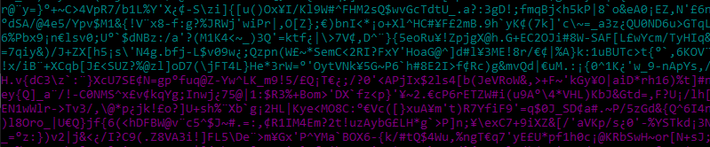

## Strong Password Generator
This password generator allows you to create a random and very safe passwords that will include uppercase letters, lowercase letters, digits and a high range of symbols.

### Default settings:  
● Characters: 100  
● Type/s of Characters: All (upper/lower/nums/syms)  
● Number of passwords: 1  

→ The maximum number of characters that can be set with the current configuration is **103**.  → By changing the upper, lower, nums and syms to `False`, you can change the type of characters that will be used.  → There is no limit in the number of passwords that you can create *(at least not a reasonable number, you can create 1 million passwords in between 8 to 13 minutes depending on your CPU/Memory usage and hardware)*.
